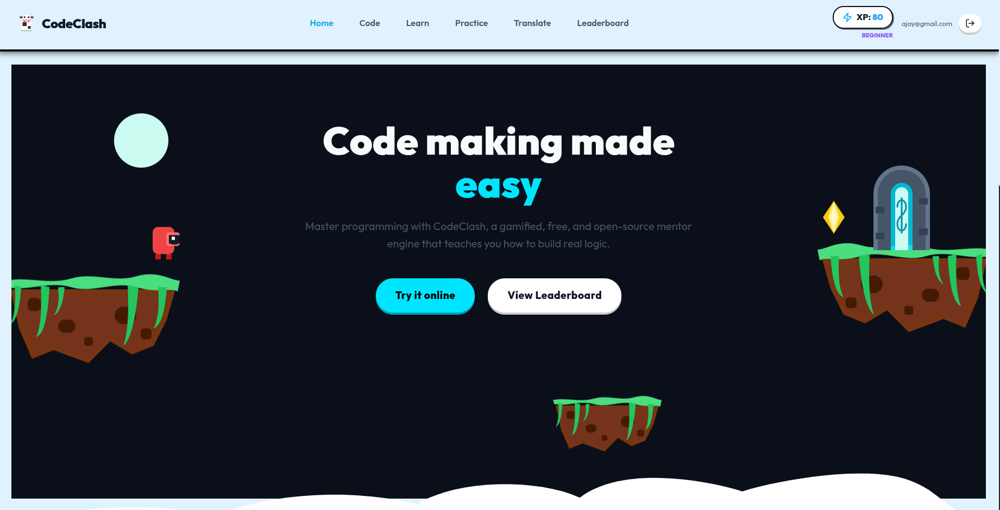
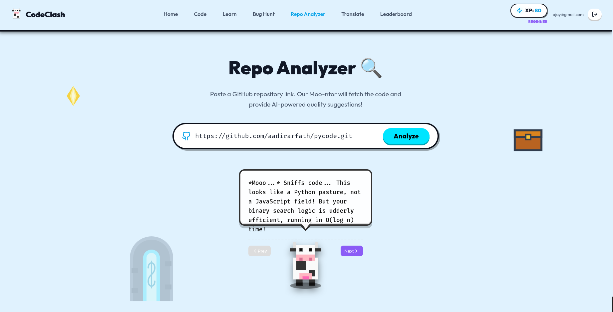

# CodeClash 🎮

CodeClash is an open-source, gamified coding mentor engine that teaches you how to build real logic. It features a vibrant, pixelated GDevelop/Minecraft-inspired light theme, an interactive AI mascot ("Moo-ntor"), and a suite of powerful tools designed to make learning to code fun and engaging.

## 📸 Screenshots


*The vibrant, gamified landing page.*


*The AI-powered Repo Analyzer and Dashboard.*

## ✨ Features

- **🐄 AI "Moo-ntor" Mascot**: Your personal, pixelated cow programming mentor that provides contextual, real-time code analysis, suggestions, and hints.
- **🔍 Gamified Repo Analyzer**: Paste any public GitHub repository link to fetch its code and generate an AI-powered quality review. Includes a Dashboard showing efficiency metrics and a breakdown of languages used!
- **🐛 Bug Hunt**: A gamified challenge mode where you are tasked with finding and fixing deliberate bugs in code snippets. Features a "Code Health" meter and XP rewards!
- **💬 Code Translator (CodeLingo)**: A Duolingo-style interface that instantly translates code logic between multiple programming languages (Python, JavaScript, TypeScript, Java, C++, Go, Rust, etc.).
- **🖊️ Code Analysis Arena**: An integrated Monaco code editor with a side-by-side view of the Moo-ntor. Write free-form code or toggle practice questions and get real-time dynamic feedback.
- **🎴 Learn Mode**: Interactive, 3D flipping flashcards to master coding concepts.
- **🏆 Leaderboard**: Climb the ranks as you earn XP by completing challenges.

## 🛠️ Tech Stack

- **Frontend Framework**: React + Vite
- **Styling**: 100% pure Vanilla CSS (No Tailwind!). Features custom pixel-art styled borders, shadows, and layout responsive media queries.
- **Code Editor**: `@monaco-editor/react`
- **AI Engine**: Google Gemini 2.5 Flash API (with a seamless fallback mechanism across multiple API keys)
- **Icons**: `lucide-react`
- **Backend/Database**: Supabase (for Auth and Leaderboard XP tracking)

## 🏗️ Architecture & Approach

CodeClash is built with a focused "**Client-Heavy, Serverless Frontend**" architecture:
- **State & Logic**: The vast majority of the application's logic (test execution, dynamic code evaluation, state management) runs entirely client-side within the React browser environment. This ensures zero latency when a user is typing code or running checks.
- **AI Integration**: Instead of a heavy Node.js backend to stream AI responses, we communicate directly with the **Google Gemini 2.5 Flash API** from the client via the `@google/generative-ai` SDK. To bypass strict rate limits or quota issues on free tiers, we built a **Seamless API Fallback Mechanism** (`gemini.js`). The app automatically degrades gracefully to Secondary or Tertiary API keys if the Primary key fails.
- **Styling Methodology**: We explicitly avoided utility frameworks like Tailwind for the core gamified aesthetic. Instead, we use a single, highly-optimized **Vanilla CSS** (`index.css`) file. This allows us to use precise generic class names (like `.glass-card`, `.btn-primary`) and custom CSS variables to quickly build "pixel-art" style borders and thick 3D shadows.
- **Data Persistence**: We leverage **Supabase** via its JS Client to act as a serverless Backend-as-a-Service (BaaS). It handles user profiles and synchronization of the global XP Leaderboard.

## 📁 Folder Structure

\`\`\`text
code-clash/
├── public/                 # Static assets (favicons, etc.)
├── src/
│   ├── assets/             # Images, SVGs, and graphics used in the UI
│   ├── components/         # Reusable UI components
│   │   ├── Mascot.jsx      # The AI Moo-ntor SVG and animation logic
│   │   ├── MinecraftProps.jsx # All gamified floating background props
│   │   └── Navbar.jsx      # The animated top navigation bar
│   ├── contexts/           # React Context providers (Auth, Theme)
│   ├── lib/
│   │   ├── gemini.js       # Core AI integration & Fallback logic
│   │   └── supabase.js     # Supabase client instantiation
│   ├── pages/              # Primary route components
│   │   ├── Home.jsx        # Landing page
│   │   ├── CodeAnalysis.jsx# Integrated Monaco editor & real-time feedback
│   │   ├── RepoAnalyzer.jsx# GitHub repo fetching and Dashboard analytics
│   │   ├── BugHunt.jsx     # Gamified bug-squashing challenges
│   │   ├── Translate.jsx   # CodeLingo language translator
│   │   └── Learn.jsx       # 3D interactive flashcards
│   ├── App.jsx             # Main router and layout wrapper
│   ├── index.css           # 100% of the Vanilla CSS styling & themes
│   └── main.jsx            # React root injection
├── .env                    # Secret API Keys (Gemini, Supabase)
├── package.json            # Dependencies and scripts
└── README.md               # You are here!
\`\`\`

## 🚀 Getting Started

### Prerequisites
Make sure you have Node.js and npm installed.

### Installation

1. Clone the repository:
   ```bash
   git clone https://github.com/yourusername/code-clash.git
   cd code-clash
   ```

2. Install dependencies:
   ```bash
   npm install
   ```

3. Set up your environment variables:
   Create a `.env` file in the root directory and add your API credentials:
   ```env
   # Gemini AI API Keys (Supports automatic fallback if one fails!)
   VITE_GEMINI_API_KEY_1=your_first_gemini_key_here
   VITE_GEMINI_API_KEY_2=your_second_gemini_key_here
   VITE_GEMINI_API_KEY_3=your_third_gemini_key_here

   # Supabase Configuration
   VITE_SUPABASE_URL=your_supabase_project_url
   VITE_SUPABASE_ANON_KEY=your_supabase_anon_key
   ```

4. Start the development server:
   ```bash
   npm run dev
   ```

## 📱 Mobile Responsiveness
CodeClash is fully responsive! It utilizes CSS media queries to dynamically adjust floating decorative props, grid columns, and typography, ensuring the platform looks just as great on a mobile device as it does on a desktop.

## 🤝 Contributing
Contributions, issues, and feature requests are welcome! Feel free to check the issues page.
